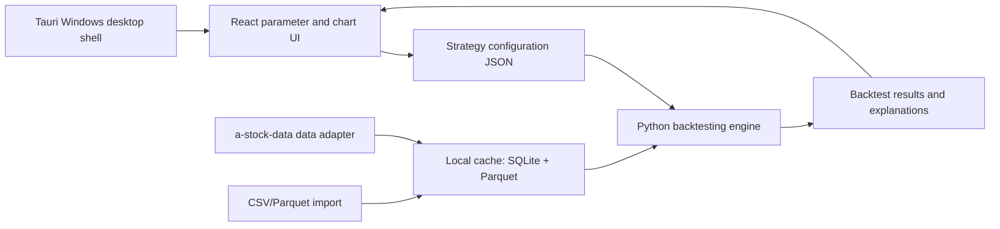

# A-Stock Historical Backtester Design

Date: 2026-05-23

## Goal

Build a Windows desktop application for A-share historical backtesting. The app lets a user assemble stock selection strategies from common technical, volume, turnover, price action, pattern, market heat, market capitalization, and capital-flow conditions, tune parameters manually, run historical simulations, and inspect expected return, risk, and trade explanations.

The first version focuses on daily-bar historical backtesting over the A-share universe. It does not support minute-level intraday backtesting, mobile offline apps, live trading, or automatic strategy recommendations.

## Product Scope

The application will be a Windows desktop app built with Tauri, React, a Python backtesting engine, and local SQLite/Parquet storage.

The workflow is:

1. Fetch and cache historical A-share daily data through `simonlin1212/a-stock-data` where available.
2. Optionally import local CSV or Parquet data.
3. Build a strategy from indicator and condition blocks.
4. Configure backtest rules, costs, dates, position sizing, and conservative execution constraints.
5. Run historical simulation using only data that would have been available at each historical decision point.
6. Review return, risk, drawdown, benchmark comparison, trades, trigger reasons, and parameter comparisons.

## Architecture

Tauri owns the desktop shell, local file access, packaging, application menus, and process orchestration.

React owns the strategy editor, backtest settings, data center, result dashboard, charts, tables, and parameter comparison UI.

Python owns data fetching adapters, data normalization, indicator calculation, market heat calculation, condition evaluation, and the backtest engine.

SQLite stores metadata, stock lists, trading calendars, strategy definitions, backtest task records, and result indexes.

Parquet stores high-volume time series data, indicator matrices, and large backtest result tables.

## Data Model And Sources

The app treats `simonlin1212/a-stock-data` as a data access layer, not as a guaranteed prebuilt local database. Data fetched from it is normalized and cached locally so later backtests can run offline against cached history.

The data center will support:

- Fetching historical daily A-share market data.
- Refreshing missing or outdated ranges.
- Inspecting local coverage by symbol, date range, and dataset type.
- Importing CSV or Parquet files as an alternative data source.
- Checking missing trading days, missing adjusted prices, and incomplete metadata.

Expected daily datasets include:

- OHLCV daily bars.
- Adjusted price data or adjustment factors.
- Turnover rate when available.
- Trading calendar.
- ST, suspension, and listing age metadata when available.
- Index data for benchmark and market heat.
- Industry or concept metadata when available.
- Market capitalization fields such as total market cap, float market cap, circulating shares, and total shares when available.
- Capital-flow fields such as main-force net inflow, large-order net inflow, retail flow, net inflow ratio, and rolling N-day inflow when available.

If industry or concept history is incomplete, first version behavior falls back to full-market heat and marks unavailable sector heat features as disabled.

## Strategy And Condition System

Strategies are assembled from a condition library instead of hardcoded templates.

Each condition definition has:

- A stable condition id.
- Display name and category.
- Parameter schema.
- Required input datasets.
- Evaluation function.
- Explanation text for trade logs.
- Whether it can be used as an entry condition, exit condition, market filter, or score condition.

First version condition categories:

- Trend and moving averages: MA5/10/20/60, moving average alignment, price crossing above or below an average.
- Technical indicators: MACD, KDJ, RSI, BOLL, including crossovers, histogram changes, overbought/oversold ranges, and band breakouts.
- Volume and turnover: volume expansion or contraction, daily volume-ratio proxy, turnover range, price-volume confirmation.
- Market capitalization and size: total market cap range, float market cap range, circulating market cap percentile, small/mid/large-cap buckets, and market-cap change filters when share data is available.
- Capital flow and large funds: main-force net inflow, large-order net inflow, net inflow ratio, rolling N-day net inflow, consecutive inflow days, inflow acceleration, and divergence between price movement and fund flow.
- Price movement: past N-day gain, maximum N-day gain, pullback size, consecutive rising or falling days.
- Candlestick and price action patterns: long bullish candle, long bearish candle, doji, gap, breakout above prior high, pullback to support.
- Market filters: ST exclusion, suspension exclusion, listing age minimum, price range, market capitalization, industry, or concept when data is available.
- Market heat: full-market and sector-level heat conditions.

Market heat is a first-version feature. It has two levels:

- Full-market heat: rising-stock ratio, limit-up count, limit-down count, total market turnover, index return, and broad money-making effect.
- Sector or theme heat: industry/concept rising ratio, sector return, sector turnover change, and limit-up count inside the sector when historical data is available.

The strategy system supports:

- Group mode: condition groups with AND/OR logic.
- Score mode: weighted conditions with a minimum total score.
- A market environment filter layer that decides whether new positions may be opened before individual stock entry rules are evaluated.

Daily volume ratio is a historical daily-bar proxy, such as current daily volume compared with average volume over a configurable prior window. It is not the same as real-time intraday volume ratio, which belongs to a later minute-level or live-data version.

Market capitalization and capital-flow fields are first-version strategy inputs when reliable historical data is available from the data adapter or imported files. These fields are versioned and stored with their original report or trade date. A signal may only use the market-cap and capital-flow values known on or before the signal date.

The condition library must be extensible enough to add many additional indicators without changing the core strategy editor. New conditions are registered through metadata, parameter schema, required datasets, and an evaluator. The first implementation should seed the library with the listed categories, then allow later additions such as valuation, shareholder structure, margin financing, northbound flow, institutional activity, auction data, and custom imported columns.

## Backtest Rules

The first version runs daily-bar historical backtests.

Default execution model:

1. Use signal-day close data and earlier data to evaluate market filters and stock conditions.
2. Buy on the next trading day's open.
3. Sell according to the earliest triggered exit rule.
4. Apply conservative execution constraints and transaction costs.

Supported entry behavior:

- Full A-share historical scan against cached data.
- Optional filters for ST, suspension, listing age, price range, and missing data.
- Equal-weight position sizing by default.
- Maximum number of new buys per day.
- Maximum total holdings.

Supported exit behavior:

- Fixed holding period.
- Take-profit and stop-loss thresholds.
- Reverse condition exits, such as MACD death cross or price falling below a moving average.
- Combined exits where the earliest valid trigger wins.

When take-profit and stop-loss are both touched within the same daily bar, conservative mode assumes the worse outcome for the strategy unless a later version has intraday data to determine event order. Simplified mode may use a configurable priority rule for research comparison, but it must label the assumption in results.

Conservative execution settings:

- Limit-up stocks cannot be bought by default.
- Limit-down stocks cannot be sold by default.
- Suspended stocks cannot trade.
- Fees, stamp tax, and slippage are configurable.
- Conservative mode is enabled by default, but simplified mode can be selected for research comparison.

The engine must prevent lookahead bias. Every condition must declare the data date it reads, and the default entry decision may only use signal-day or earlier data. Buy-day or later information cannot be used in entry selection.

## User Interface

The first version has five main work areas.

### Data Center

Shows local cache coverage, stock count, available date range, dataset freshness, and data quality warnings. Provides actions to fetch missing history, refresh recent data, import CSV/Parquet, and validate cache completeness. Coverage is shown by dataset family, including price bars, adjustment data, turnover, market heat, market capitalization, capital flow, and sector/theme data.

### Strategy Editor

Shows the condition library on the left, condition groups in the middle, and parameter controls on the right. Controls are checkboxes, selects, numeric inputs, sliders where useful, and toggles. Users can enable or disable conditions, choose AND/OR grouping, and configure weighted score mode. The library is searchable and grouped by category so a large option set, including market cap, capital flow, market heat, technical indicators, and custom imported columns, remains usable.

### Backtest Settings

Includes date range, initial capital, fees, stamp tax, slippage, benchmark index, fixed holding period, take-profit, stop-loss, maximum holdings, maximum daily buys, ST filtering, suspension handling, listing age filter, and conservative execution mode.

### Result Overview

Prioritizes total return, annualized return, maximum drawdown, win rate, equity curve, drawdown curve, benchmark comparison, trade count, average trade return, and risk/return summary.

### Explanation And Comparison

Shows each trade with buy reason, sell reason, triggered conditions, data date, trade date, execution price, unavailable-trade reason, and cost impact. Also supports comparing multiple parameter runs by return, drawdown, win rate, trade count, and profit/loss ratio.

## Error Handling

Data fetch errors show the affected symbols, date range, source, error message, and retry action.

Backtests run a preflight check before execution. The check reports missing prices, missing trading days, missing adjustment data, unavailable turnover, unavailable market heat, and unsupported sector heat.

Preflight also reports missing market-cap and capital-flow datasets when the selected strategy requires them. The app must distinguish between "condition unavailable because the dataset is missing" and "condition evaluated false because the historical value does not pass the threshold."

Invalid strategy parameters are rejected in the editor with field-level errors. Examples include window length below 1, stop-loss above 0 when represented as a negative threshold, empty score weights, and impossible date ranges.

Backtest results include explicit non-trade reasons such as limit-up buy blocked, limit-down sell blocked, suspension, missing data, and max position limit reached.

The UI must not silently invent unavailable data. Missing sector heat downgrades to full-market heat only when the user accepts that mode or when the strategy does not require sector heat.

## Testing Strategy

Testing focuses on correctness before performance.

Required test areas:

- Indicator calculations for moving averages, MACD, KDJ, RSI, BOLL, turnover-derived conditions, past gains, and market heat.
- Market capitalization and capital-flow condition calculations, including rolling windows, consecutive inflow days, inflow ratios, and date-bound availability.
- Condition evaluation for AND/OR groups, score thresholds, market filters, and reverse exits.
- Lookahead prevention for signal date, buy date, sell date, and derived indicators.
- Execution rules for limit-up, limit-down, suspension, fixed holding, take-profit, stop-loss, reverse conditions, fees, stamp tax, and slippage.
- Data cache validation and CSV/Parquet import normalization.
- Strategy serialization and replay consistency.
- Result metric calculations for return, annualized return, drawdown, win rate, trade count, and benchmark comparison.

## First-Version Non-Goals

The first version will not include:

- Minute-level or intraday backtesting.
- Order book or live quote simulation.
- Mobile offline application.
- Online account sync.
- Live trading or broker integration.
- Automatic promise of profitable strategies.
- Complex sector or concept heat if reliable historical sector membership and sector market data are unavailable.

## Implementation Notes

The implementation should keep boundaries explicit:

- UI strategy configuration is JSON and versioned.
- Python condition definitions are registered through a stable schema.
- Data adapters normalize external fields before storing them.
- The backtest engine reads normalized local data, not raw API responses.
- Every generated result records the strategy version, data coverage, cost settings, and execution model.

This keeps the first Windows version useful while preserving a path toward later mobile, web service, or more advanced data integrations.
